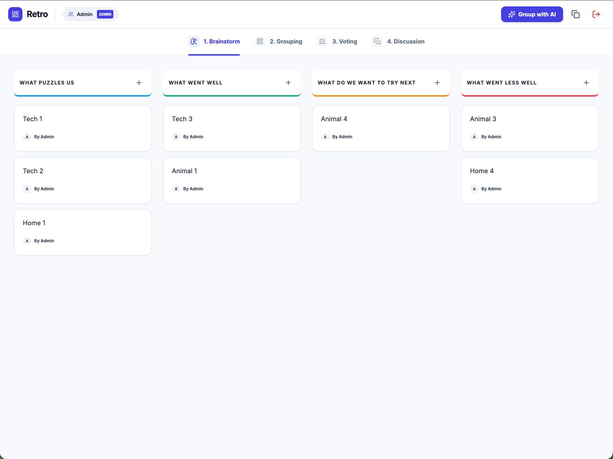
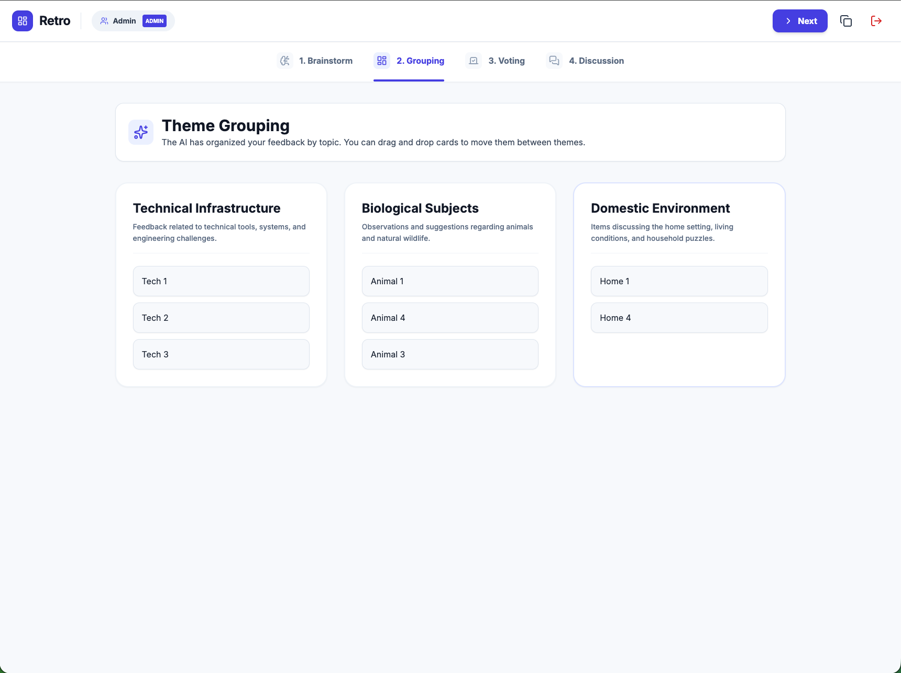
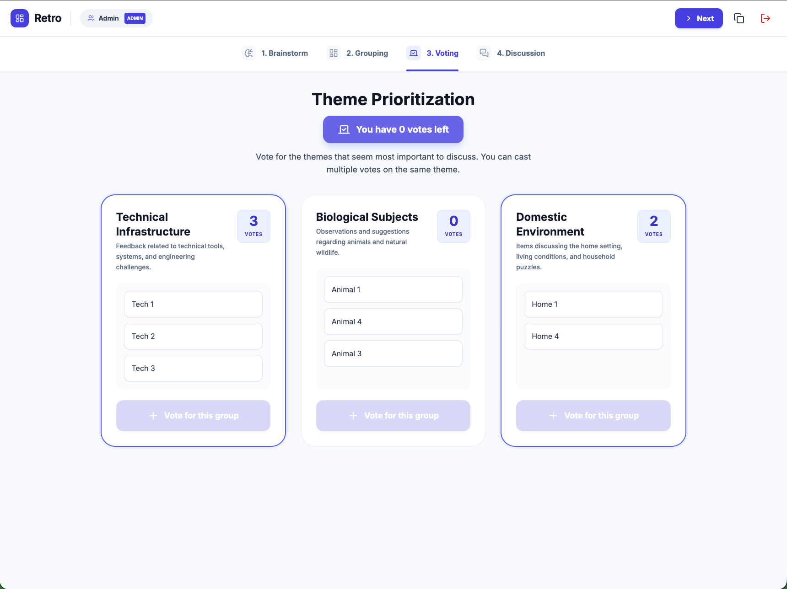
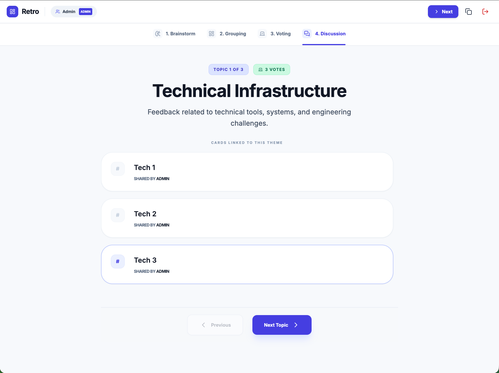

# Retro - AI Agile Retrospective

**Retro** is a collaborative agile retrospective tool designed to make team feedback sessions seamless and intelligent. It leverages AI to handle the tedious parts of a retrospective, allowing teams to focus on what matters: improvement.

## 🚀 Key Features

- **Collaborative Brainstorming**: Participants join a shared session in real-time to submit feedback tickets.
- **✨ AI-Powered Grouping**: Integrated with **Google Gemini** to automatically categorize hundreds of tickets into logical themes in seconds.
- **Democratic Voting**: Team members vote on the most critical themes to ensure the most important topics get debated.
- **Structured Discussion**: A focused mode to walk through themes one by one, sorted by priority.
- **Structured Discussion**: A focused mode to walk through themes one by one, sorted by priority.
- **Seamless Joining**: No accounts required—admins create a session and share a link to let anyone join instantly.
- **🔒 Secure Authentication**: Includes admin registration, login, and secure password reset via email.

## 🛠️ Tech Stack

- **Frontend**: React 19, Vite, TypeScript
- **Backend**: Node.js, Express, Socket.io
- **AI**: Google Generative AI (Gemini 2.5 Flash via Server Proxy)
- **Database**: MySQL with Sequelize ORM
- **Infrastructure**: Docker & Docker Compose
- **Styling**: Vanilla CSS with modern aesthetics
- **Icons**: Lucide React

## 📸 Screenshots

<div align="center">
  
  
  
  
</div>

## 🛠️ Getting Started

### Prerequisites
- Node.js (v18+)
- Docker & Docker Compose (Recommended for Database)
- A Google Gemini API Key

### Installation

1. Clone the repository
2. Install dependencies for both frontend and backend:
   ```bash
   npm install
   ```
3. Create your local env file from the example:
   ```bash
   cp .env.example .env
   ```
4. Update `.env` with your own secret values:
   ```env
   # AI Configuration
   GEMINI_API_KEY=your_gemini_api_key_here

   # Server Configuration
   PORT=3001
   JWT_SECRET=replace_with_a_long_random_secret
   CORS_ORIGINS=http://localhost:3000

   # Database Configuration (Docker defaults)
   DB_HOST=localhost
   DB_USER=root
   DB_PASSWORD=replace_with_strong_db_password
   DB_NAME=retro
   MAX_VOTES_PER_USER=5
   DB_CONNECT_RETRIES=20
   DB_CONNECT_RETRY_DELAY_MS=2000

   # Frontend Configuration
   VITE_SOCKET_URL=http://localhost:3001

   # Email Configuration (SMTP) - Required for Password Reset
   SMTP_HOST=smtp.example.com
   SMTP_PORT=587
   SMTP_USER=user@example.com
   SMTP_PASS=password
   SMTP_FROM="Retro App" <no-reply@example.com>
   CLIENT_URL=http://localhost:3000
   ```
5. Generate a strong JWT secret (example):
   ```bash
   openssl rand -hex 32
   ```

### 🐳 Running with Docker (Recommended)

The easiest way to get everything running, including the MySQL database, is using Docker:

```bash
docker-compose up --build
```

The app will be available at `http://localhost:3000`.

If `docker-compose` reports missing variables, verify your `.env` contains:
`DB_PASSWORD`, `JWT_SECRET`, and `GEMINI_API_KEY`.

### 🛠️ Manual Execution

If you prefer to run things manually:

1. **Start MySQL**: Ensure you have a MySQL server running and a database named `retro` created.
2. **Start the Sync Server** (Backend):
   ```bash
   npm run server
   ```
3. **Start the Frontend** (in a separate terminal):
   ```bash
   npm run dev
   ```

The app will be available at `http://localhost:3000`.

## 🔒 Security Note
This application uses a server-side proxy to communicate with the Gemini API. This ensures that your API keys are never exposed to the client-side bundle. Additionally, session updates are validated on the server to ensure only authorized admins can change the retro phase.

## ✅ Production Hardening Included
- **Admin identity verification on sockets**: admin actions require a valid JWT-linked admin identity.
- **Server-side session update controls**: participant updates are constrained by phase and cannot tamper with admin/phase ownership.
- **Protected admin HTTP endpoints**: session creation/history require `Authorization: Bearer <token>`.
- **Basic API abuse protection**: auth routes include request-rate limiting and secure response headers.
- **CORS allowlist support**: configure `CORS_ORIGINS` explicitly in production.

## 📄 License

This project is licensed under the MIT License - see the [LICENSE](LICENSE) file for details.

## 🤝 Community

- [Security Policy](SECURITY.md)
- [Contributing Guidelines](CONTRIBUTING.md)
